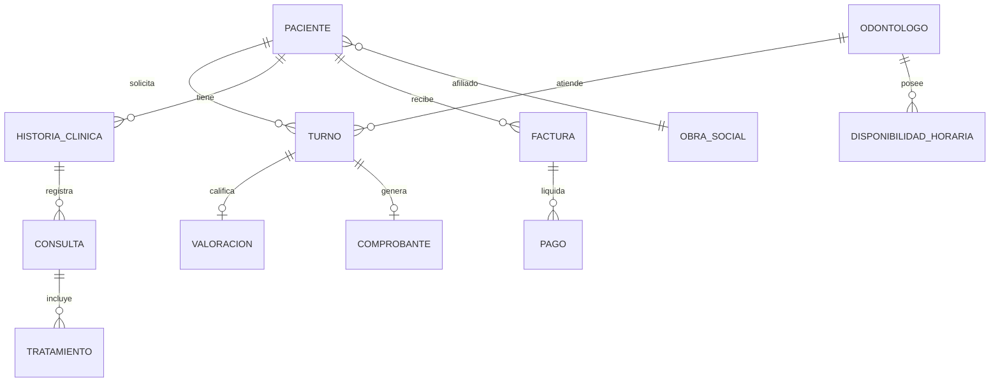

# TurnoMolar - Sistema de Gestion Odontologica y Turnos

> **Proyecto de Seminario Integrador**  
> Sistema integral para la digitalizacion, agendamiento y gestion de atencion odontologica en **Clinica Dental Rosario**.

---

## Indice
1. [Descripcion General](#descripcion-general)
2. [Objetivos del Proyecto](#objetivos-del-proyecto)
3. [Arquitectura del Sistema](#arquitectura-del-sistema)
4. [Estructura del Proyecto](#estructura-del-proyecto)
5. [Casos de Uso Principales (CUU / BSQ)](#casos-de-uso-principales-cuu--bsq)
6. [Stack Tecnologico](#stack-tecnologico)
7. [Modelo de Datos](#modelo-de-datos)
8. [Instalacion y Puesta en Marcha](#instalacion-y-puesta-en-marcha)
9. [Configuracion de Base de Datos](#configuracion-de-base-de-datos)
10. [Datos de Prueba](#datos-de-prueba)
11. [Integrantes del Grupo](#integrantes-del-grupo)
12. [Materia y Contexto Academico](#materia-y-contexto-academico)

---

## Descripcion General

**TurnoMolar** es una plataforma web desarrollada en **.NET 8** bajo una **arquitectura en capas (N-Layer Architecture)**, disenada para modernizar la atencion clinica y el autoservicio de pacientes. Permite a los pacientes solicitar turnos en tiempo real visualizando disponibilidad horaria por profesional y especialidad, descargar comprobantes oficiales con codigo QR, gestionar pagos y coberturas medicas, y calificar la atencion recibida.

A su vez, proporciona al equipo odontologico y administrativo herramientas para gestionar agendas, historiales clinicos, insumos medicos y facturacion.

---

## Objetivos del Proyecto

- **Optimizacion de Agendamiento**: Reduccion de tiempos de espera y cancelacion de citas mediante un asistente (Wizard) paso a paso.
- **Deteccion Temprana de Inhabilitacion**: Verificacion automatica de estado financiero del paciente (inhabilitacion preventiva en caso de deuda exigible).
- **Trazabilidad Clinica**: Registro centralizado de atenciones, diagnosticos y consultas en la historia clinica digital.
- **Autonomia del Paciente**: Portal intuitivo para reprogramar turnos, consultar saldos, pagar aranceles y validar obras sociales.
- **Interoperabilidad y Escalabilidad**: Separacion desacoplada entre capa de dominio, persistencia, logica de aplicacion, API REST y clientes frontend (MVC y Blazor).

---

## Arquitectura del Sistema

El proyecto implementa una arquitectura desacoplada orientada al dominio:

```
+-------------------------------------------------------------+
|                       PRESENTACION                          |
|   Frontend.MVC (Portal Paciente)  |  Blazor (Panel Admin)   |
+------------------------------+------------------------------+
                               | HTTP / JSON / Service Call
+------------------------------v------------------------------+
|                    WebAPI (RESTful API)                     |
|               Controladores, Swagger, CORS                  |
+------------------------------+------------------------------+
                               |
+------------------------------v------------------------------+
|             Application.Services (Capa de Negocio)          |
|        Casos de Uso, Validaciones, Logica Operativa         |
+--------------+------------------------------+---------------+
               |                              |
+--------------v--------------+ +-------------v---------------+
|     DTOs (Data Transfer)    | |   Domain.Model (Entidades)   |
+-----------------------------+ +-------------+---------------+
                                              |
+---------------------------------------------v---------------+
|                     Data (Acceso a Datos)                   |
|        Entity Framework Core 8, DbContext, Migrations       |
+------------------------------+------------------------------+
                               | T-SQL / ADO.NET
+------------------------------v------------------------------+
|            Microsoft SQL Server Express / Cloud DB          |
+-------------------------------------------------------------+
```

---

## Estructura del Proyecto

| Proyecto / Directorio | Responsabilidad |
| :--- | :--- |
| **`Domain.Model`** | Entidades de negocio (`Paciente`, `Odontologo`, `Turno`, `HistoriaClinica`, `Factura`, `Pago`, `ObraSocial`, `Insumo`, etc.), enums y contratos de dominio. |
| **`DTOs`** | Objetos de transferencia de datos para el intercambio seguro y tipado entre capas. |
| **`Data`** | Configuracion de Entity Framework Core 8 (`TurnoMolarDbContext`), mapeos Fluent API, migraciones y seed data. |
| **`Application.Services`** | Implementacion de las reglas de negocio, validaciones de disponibilidad y orquestacion de casos de uso. |
| **`WebAPI`** | API RESTful documentada con Swagger/OpenAPI para la interoperabilidad con clientes moviles o web. |
| **`Frontend.MVC`** | Portal web del paciente desarrollado en ASP.NET Core MVC con diseno responsive, layout unificado y estetica profesional. |
| **`Blazor.Server` / `Blazor.WebAssembly`** | Modulos administrativos para recepcion, gestion de consultorios y control de agendas. |
| **`Application.Services.Tests` / `WebAPI.Tests`** | Suite de pruebas unitarias y de integracion. |

---

## Casos de Uso Principales (CUU / BSQ)

### 1. CUU01 - Solicitar / Reservar Turno
- **Paso 1**: Seleccion de especialidad medica (Ortodoncia, Implantes, General, etc.).
- **Paso 2**: Calendario interactivo con dias libres destacados con marco verde y seleccion de slots por turnos (Manana / Tarde).
- **Paso 3**: Seleccion de odontologo disponible y validacion automatica de habilitacion de paciente.
- **Paso 4**: Confirmacion de cobertura (Obra Social / Prepaga / Particular).
- **Emision de Comprobante**: Generacion de ticket digital con codigo QR, opcion para imprimir o guardar como PDF.

### 2. CUU02 - Reprogramar y Modificar Turno
- Posibilidad de cambiar fecha, horario y profesional desde la pestana Mis Turnos.

### 3. CUU03 - Cancelar Turno
- Cancelacion con confirmacion interactiva y liberacion instantanea del cupo en la agenda medica.

### 4. CUU04 - Valoracion de Atencion Odontologica
- Calificacion por estrellas (1 a 5) y envio de comentarios de satisfaccion tras completar una consulta.

### 5. CUU05 - Gestion de Estado de Cuenta y Metodos de Pago
- Consulta de saldos adeudados, pago con tarjeta de credito/debito y rehabilitacion automatica del paciente a estado HABILITADO.

### 6. CUU06 - Cobertura Medica y Obras Sociales
- Visualizacion de credencial digital activa (ej. OSDE Plan 210) y modulo para adjuntar nueva credencial ante cambios de prestador.

---

## Stack Tecnologico

- **Lenguaje Principal**: C# 12
- **Framework Base**: .NET 8.0 LTS
- **Motor ORM**: Entity Framework Core 8 (Code-First con Migraciones)
- **Base de Datos**: Microsoft SQL Server Express 2022 / Cloud MSSQL (Somee)
- **Frontend MVC**: 
  - ASP.NET Core Razor Pages / Views
  - HTML5 Semantico + CSS3 (Variables Custom + Grid + Flexbox)
  - JavaScript Vanilla (ES6+)
  - Bootstrap 5.3 & Bootstrap Icons
  - Tipografia: Plus Jakarta Sans (Google Fonts)
- **Documentacion API**: Swagger UI / OpenAPI Specification
- **Testing**: xUnit, Moq

---

## Modelo de Datos

El esquema relacional incluye **17 tablas principales**:



---

## Instalacion y Puesta en Marcha

### Prerrequisitos
- .NET 8.0 SDK instalado.
- SQL Server Express o acceso a un servidor MSSQL remoto.
- Visual Studio 2022 / VS Code / JetBrains Rider.

### Clonacion del Repositorio
```bash
git clone https://github.com/tu-usuario/TurnoMolar-Seminario-Integrador.git
cd TurnoMolar-Seminario-Integrador/Develop
```

### Restauracion de Paquetes NuGet
```bash
dotnet restore DentalClinic.sln
```

---

## Configuracion de Base de Datos

1. Configurar la cadena de conexion en `WebAPI/appsettings.json` o `Frontend.MVC/appsettings.json`:
```json
{
  "ConnectionStrings": {
    "DefaultConnection": "Server=clinicakarina_db.mssql.somee.com;Database=clinicakarina_db;User Id=manufg2006_SQLLogin_1;Password=jgvph71xn9;TrustServerCertificate=True;"
  }
}
```

2. Aplicar las migraciones para crear la estructura de tablas y datos iniciales:
```bash
dotnet ef database update --project Data --startup-project WebAPI
```

---

## Ejecucion del Proyecto

### 1. Iniciar la API Backend
```bash
cd WebAPI
dotnet run
```
Swagger UI disponible en: `https://localhost:7043/swagger`

### 2. Iniciar el Portal Web Paciente (MVC)
```bash
cd Frontend.MVC
dotnet run
```
Portal del Paciente disponible en: `http://localhost:5247` o `https://localhost:7172`

---

## Datos de Prueba (Seed Data)

| Rol | Usuario / Email | Identificador / DNI | Estado Inicial |
| :--- | :--- | :--- | :--- |
| **Paciente** | Manuel Fernandez (`manuel.fer@email.com`) | ID: `#10042` / DNI: `34.567.890` | `HABILITADO` (OSDE 210) |
| **Odontologa** | Dra. Elena Silva | Matricula: `MP 4512` | Especialista en Ortodoncia |
| **Odontologo** | Dr. Martin Lopez | Matricula: `MP 5120` | Cirugia e Implantes |
| **Odontologa** | Dra. Karina Gonzalez | Matricula: `MP 3840` | Odontologia General |

---

## Integrantes del Grupo

- **Manuel Fernandez**
- **Alexis Mateo**
- **Bautista Alfaro**
- **Santiago Martina**

---

## Materia y Contexto Academico

- **Asignatura**: Seminario Integrador
- **Carrera**: Ingenieria en Sistemas de Informacion / Licenciatura en Sistemas
- **Ano lectivo**: 2026
- **Proyecto**: Plataforma de Gestion TurnoMolar para la Clinica Dental Rosario