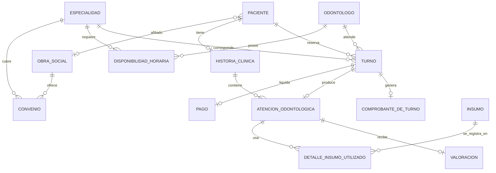

# TurnoMolar - Sistema de Gestión Odontológica y Turnos

> **Proyecto de Seminario Integrador**
> Sistema integral para la digitalización, agendamiento y gestión de atención odontológica en **Clínica Dental Rosario**.

---

## Índice
1. [Descripción General](#descripción-general)
2. [Objetivos del Proyecto](#objetivos-del-proyecto)
3. [Arquitectura del Sistema](#arquitectura-del-sistema)
4. [Estructura del Proyecto](#estructura-del-proyecto)
5. [Casos de Uso Principales (CUU)](#casos-de-uso-principales-cuu)
6. [Stack Tecnológico](#stack-tecnológico)
7. [Modelo de Datos](#modelo-de-datos)
8. [Instalación y Puesta en Marcha](#instalación-y-puesta-en-marcha)
9. [Configuración de Base de Datos](#configuración-de-base-de-datos)
10. [Ejecución del Proyecto](#ejecución-del-proyecto)
11. [Datos de Prueba](#datos-de-prueba-seed-data)
12. [Integrantes del Grupo](#integrantes-del-grupo)
13. [Materia y Contexto Académico](#materia-y-contexto-académico)

---

## Descripción General

**TurnoMolar** es una plataforma web desarrollada en **.NET 8** bajo una **arquitectura en capas (N-Layer Architecture)**, diseñada para modernizar la atención clínica y el autoservicio de pacientes. Permite a los pacientes solicitar turnos en tiempo real visualizando disponibilidad horaria real por profesional y especialidad, descargar comprobantes con código QR, gestionar su estado de cuenta y calificar la atención recibida.

A su vez, busca proporcionar al equipo odontológico y administrativo herramientas para gestionar agendas, historiales clínicos e insumos médicos.

---

## Objetivos del Proyecto

- **Optimización de Agendamiento**: reducción de tiempos de espera mediante un asistente (wizard) paso a paso, con calendario y horarios reales.
- **Detección Temprana de Inhabilitación**: verificación automática del estado financiero del paciente (inhabilitación preventiva en caso de deuda exigible).
- **Trazabilidad Clínica**: registro centralizado de atenciones y consultas en la historia clínica digital.
- **Autonomía del Paciente**: portal para reprogramar turnos, cancelarlos y consultar su estado de cuenta.
- **Interoperabilidad**: separación entre capa de dominio, persistencia, lógica de aplicación, API REST y clientes frontend (MVC y Blazor).

---

## Arquitectura del Sistema

El proyecto implementa una arquitectura en capas orientada al dominio. **Frontend.MVC no pasa por la WebAPI**: referencia `Application.Services` directamente y comparte proceso con él, para no duplicar lógica de negocio entre los dos frontends. La WebAPI expone esa misma capa de servicios por HTTP para consumidores externos (Blazor, apps móviles, terceros).

```
+-------------------------------------------------------------+
|                        PRESENTACIÓN                         |
|   Frontend.MVC (Portal Paciente)   |  Blazor (Panel Admin)  |
+------------------+--------------------------+---------------+
                    | (in-process)             | HTTP / JSON
                    |                +---------v-------------+
                    |                |  WebAPI (RESTful API) |
                    |                |  Controladores, Swagger|
                    |                +---------+-------------+
                    |                          |
+-------------------v--------------------------v---------------+
|              Application.Services (Capa de Negocio)          |
|         Casos de Uso, Validaciones, Lógica Operativa         |
+--------------+------------------------------+----------------+
               |                              |
+--------------v--------------+ +-------------v---------------+
|     DTOs (Data Transfer)    | |   Domain.Model (Entidades)  |
+-----------------------------+ +-------------+---------------+
                                              |
+---------------------------------------------v---------------+
|                     Data (Acceso a Datos)                   |
|         Entity Framework Core 8, DbContext, seed data       |
+------------------------------+------------------------------+
                               | T-SQL / ADO.NET
+------------------------------v------------------------------+
|                     Microsoft SQL Server                    |
+-------------------------------------------------------------+
```

---

## Estructura del Proyecto

| Proyecto / Directorio | Responsabilidad |
| :--- | :--- |
| **`Domain.Model`** | Entidades de negocio (`Paciente`, `Odontologo`, `Turno`, `HistoriaClinica`, `ComprobanteDeTurno`, `Pago`, `ObraSocial`, `Insumo`, etc.) y contratos de dominio. Incluye también algunas clases de una versión anterior del modelo (`Factura`, `Consulta`, `Multa`, `Consultorio`, `HorarioOdont`) que ya no están mapeadas en el DbContext ni en uso — quedan pendientes de limpieza. |
| **`DTOs`** | Objetos de transferencia de datos para el intercambio entre capas. |
| **`Data`** | Configuración de Entity Framework Core 8 (`TurnoMolarDbContext`), repositorios, mapeos Fluent API y seed data (`DbInitializer`). |
| **`Application.Services`** | Implementación de las reglas de negocio, validaciones de disponibilidad y orquestación de casos de uso. |
| **`WebAPI`** | API RESTful documentada con Swagger/OpenAPI, para consumidores externos a Frontend.MVC. |
| **`Frontend.MVC`** | Portal web del paciente en ASP.NET Core MVC. |
| **`Blazor.Server` / `Blazor.WebAssembly`** | Módulos administrativos para recepción y gestión de agendas. |
| **`Application.Services.Tests` / `WebAPI.Tests`** | Proyectos de test scaffoldeados; todavía sin casos de prueba propios del dominio. |

---

## Casos de Uso Principales (CUU)

Estado real a la fecha, verificado contra la documentación del proyecto (casos de uso, reglas de negocio y máquina de estados):

### 1. CUU01 - Agendar Turno Odontológico — ✅ Implementado
- El sistema valida primero el estado del paciente: si tiene deuda pendiente lo informa y permite saldarla; si ya tiene un turno reservado pendiente de atención, no deja pedir otro.
- Calendario y horarios disponibles reales, calculados a partir de la disponibilidad horaria de cada odontólogo y los turnos ya ocupados (no hay selección de odontólogo aparte: cada horario ya pertenece a un profesional puntual).
- Verificación de convenio vigente de la obra social para la especialidad elegida; si no corresponde, se ofrece pagar en forma particular.
- Confirmación con política de cancelación informada, registro del turno en estado `Reservado` y emisión de comprobante con código QR.
- Alta manual por el Responsable de la Clínica para cuando el paciente no encuentra un turno disponible/conveniente.

### 2. CUU02 - Reprogramar Turno — ⚠️ Parcial
Existe la función desde "Mis Turnos". Se corrigió un bug que dejaba el turno nuevo en un estado inexistente (`Confirmado`) en lugar de `Reservado`, lo que rompía la detección de "turno pendiente" de CUU01. Falta todavía revisar el resto del caso de uso contra su documentación específica (antelación mínima, camino alterno del Responsable).

### 3. CUU03 - Cancelar Turno — ⚠️ Parcial
Existe cancelación con penalización si se hace con menos de 24 hs de anticipación. Pendiente de revisión formal contra su documentación específica.

### 4. CUU04 - Valorar Atención Odontológica — ⚠️ Parcial
Existe calificación por estrellas (1 a 5) y comentario de satisfacción. Pendiente de revisión formal contra su documentación específica.

### 5. CUU05 - Gestión de Estado de Cuenta — 🔜 Pendiente
Hoy solo existe una función mínima (saldar toda la deuda de una vez) como parte del camino alternativo de CUU01. No hay todavía selección de método de pago ni pantalla propia de estado de cuenta.

### 6. CUU06 - Cobertura Médica y Obras Sociales — 🔜 Pendiente
El modelo de obra social/convenio existe y ya se usa dentro de CUU01, pero no hay una pantalla dedicada para que el paciente gestione o adjunte su credencial.

---

## Stack Tecnológico

- **Lenguaje Principal**: C# 12
- **Framework Base**: .NET 8.0 LTS
- **Motor ORM**: Entity Framework Core 8. El esquema se crea y se siembra automáticamente al arrancar (`DbInitializer`, vía `EnsureCreatedAsync`); el repositorio también incluye una carpeta `Migrations/` para evolución de esquema, pero **no es el mecanismo que usa la app al arrancar hoy**.
- **Base de Datos**: Microsoft SQL Server (instancia local para desarrollo).
- **Frontend MVC**:
  - ASP.NET Core Razor Views
  - HTML5 + CSS3 (variables custom, Grid, Flexbox)
  - JavaScript vanilla (ES6+) para las partes dinámicas del wizard de turnos
  - Bootstrap 5.3 y Bootstrap Icons
  - Tipografía: Plus Jakarta Sans (Google Fonts)
- **Documentación API**: Swagger UI / OpenAPI
- **Testing**: proyectos con xUnit ya referenciados, sin casos de prueba propios todavía.

---

## Modelo de Datos

El esquema relacional activo tiene **15 tablas** (`DbSet`) reales en `TurnoMolarDbContext`:
`Pacientes`, `Odontologos`, `ResponsablesClinica`, `Especialidades`, `ObrasSociales`, `Convenios`, `DisponibilidadesHorarias`, `Turnos`, `ComprobantesTurnos`, `AtencionesOdontologicas`, `HistoriasClinicas`, `Insumos`, `DetallesInsumosUtilizados`, `Pagos`, `Valoraciones`.



---

## Instalación y Puesta en Marcha

### Prerrequisitos
- .NET 8.0 SDK instalado.
- SQL Server (local o accesible en red).
- Visual Studio 2022 / VS Code / JetBrains Rider.

### Clonación del Repositorio
```bash
git clone https://github.com/TurnoMolar-Seminario-Integrador/Repository.git
cd Repository
```

### Restauración de Paquetes NuGet
```bash
dotnet restore DentalClinic.sln
```

### Compilación
```bash
dotnet build DentalClinic.sln
```
Si venís de una compilación anterior con errores raros o dependencias corridas, limpiá antes de compilar (borra los `bin/`/`obj/` generados, no toca el código fuente):
```bash
dotnet clean DentalClinic.sln
dotnet build DentalClinic.sln
```

---

## Configuración de Base de Datos

1. Configurar la cadena de conexión en `WebAPI/appsettings.json` y `Frontend.MVC/appsettings.json`:
```json
{
  "ConnectionStrings": {
    "DefaultConnection": "Server=localhost;Database=clinicakarina_local;Integrated Security=True;TrustServerCertificate=True;MultipleActiveResultSets=true"
  }
}
```
Si el equipo trabaja contra un servidor remoto compartido, **no subas usuario y contraseña reales a este archivo ni al repositorio**: usá `dotnet user-secrets` o una variable de entorno, y compartí las credenciales por un canal aparte.

2. No hace falta correr migraciones a mano: al iniciar cualquiera de los dos proyectos (`WebAPI` o `Frontend.MVC`), `DbInitializer` crea la base si no existe (`EnsureCreatedAsync`) y siembra los datos iniciales automáticamente.

---

## Ejecución del Proyecto

### 1. Iniciar la API Backend
```bash
cd WebAPI
dotnet run
```
Swagger UI disponible en: `https://localhost:7043/swagger`

### 2. Iniciar el Portal Web Paciente (MVC)
```bash
cd Frontend.MVC
dotnet run
```
Portal del Paciente disponible en: `http://localhost:5247` o `https://localhost:7172`

---

## Datos de Prueba (Seed Data)

| Rol | Usuario | DNI | Especialidad / Cobertura |
| :--- | :--- | :--- | :--- |
| **Paciente** | Manuel Fernández (`manuel.fer@email.com`) | `34567890` | `HABILITADO`, con obra social OSDE |
| **Odontóloga** | Dra. Karina González (MP 3840) | `28456789` | Odontología General — Lunes y Martes 8 a 13 hs |
| **Odontóloga** | Dra. Elena Silva (MP 4512) | `30123456` | Endodoncia — Miércoles 14 a 19 hs |
| **Odontólogo** | Dr. Martín López (MP 5120) | `26789012` | Ortodoncia — Jueves 9 a 18 hs |

> Cirugía e Implantes y Odontopediatría todavía no tienen ningún odontólogo ni disponibilidad horaria cargados en el seed — al elegirlas en el wizard de turnos no va a haber nada para reservar hasta que se agregue esa disponibilidad.

---

## Integrantes del Grupo

- **Manuel Fernández**
- **Alexis Mateo**
- **Bautista Alfaro**
- **Santiago Martina**

---

## Materia y Contexto Académico

- **Asignatura**: Seminario Integrador
- **Carrera**: Ingeniería en Sistemas de Información / Licenciatura en Sistemas
- **Año lectivo**: 2026
- **Proyecto**: Plataforma de Gestión TurnoMolar para la Clínica Dental Rosario